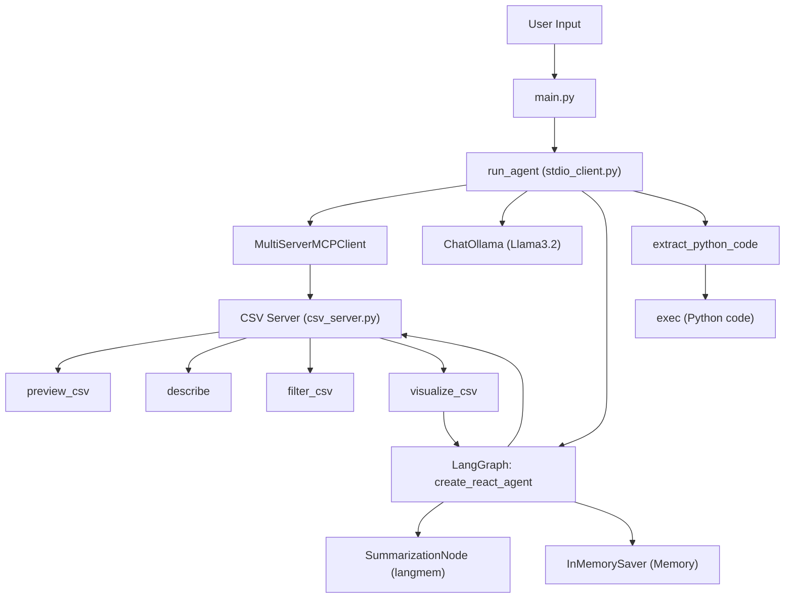

# CSV Agent: Components and Architecture

## Overview
This project implements a conversational CSV agent that can analyze, describe, and visualize CSV data. It leverages modern AI agent frameworks and modular server-client architecture.

---

## Main Components

### 1. **User Interface**
- **main.py**: Entry point. Accepts user commands and passes them to the agent.

### 2. **Agent Client**
- **app/mcp_setup/client/stdio_client.py**: Implements the `run_agent` function, which:
  - Determines user intent (describe, visualize, preview)
  - Connects to the MCP server using `MultiServerMCPClient`
  - Sets up the agent using LangGraph's `create_react_agent`
  - Integrates memory (summarization, in-memory checkpointing)
  - Invokes the LLM (Ollama Llama3.2)
  - Extracts and executes Python code generated by the agent

### 3. **MCP Server**
- **app/mcp_setup/servers/csv_server.py**: Implements the CSV server using `FastMCP`.
  - Exposes tools: `preview_csv`, `describe`, `filter_csv`, and a prompt for `visualize_csv`.
  - Handles CSV file operations and returns results to the agent.

### 4. **LLM & Tools**
- **ChatOllama (Llama3.2)**: The language model used for intent detection and code generation.
- **LangGraph**: Used to create the agent (`create_react_agent`), manage tool usage, and integrate memory.
- **Memory**:
  - `SummarizationNode` (from `langmem`): Summarizes conversation for context retention.
  - `InMemorySaver`: Stores agent state/checkpoints in memory.

---

## Component Diagram

---

## Data & Message Flow
1. **User** enters a command (e.g., "Describe data.csv").
2. **main.py** passes the command to `run_agent`.
3. **run_agent**:
   - Detects intent using the LLM.
   - Connects to the CSV MCP server.
   - Sets up the agent with LangGraph, memory, and tools.
   - If visualization is requested, fetches a prompt template from the server.
   - Invokes the agent, which may generate Python code for visualization.
   - Extracts and executes the code if present.
4. **CSV Server** executes the requested tool (preview, describe, filter, visualize) and returns results.
5. **Agent** maintains context and memory for multi-turn conversations.

---

## Key Technologies
- **MCP (Multi-Component Protocol)**: Modular server-client protocol for tool integration.
- **LangGraph**: Agent orchestration, tool management, and memory integration.
- **Ollama (Llama3.2)**: Local LLM for intent detection and code generation.
- **Pandas, Matplotlib**: Data analysis and visualization libraries.
- **Memory**: Summarization and in-memory checkpointing for conversational context.

---

## Extending the System
- Add new tools to the CSV server for more data operations.
- Swap out the LLM or memory backend as needed.
- Integrate with other data sources or visualization libraries.

---

For more details, see the code in `app/mcp_setup/client/stdio_client.py` and `app/mcp_setup/servers/csv_server.py`. 